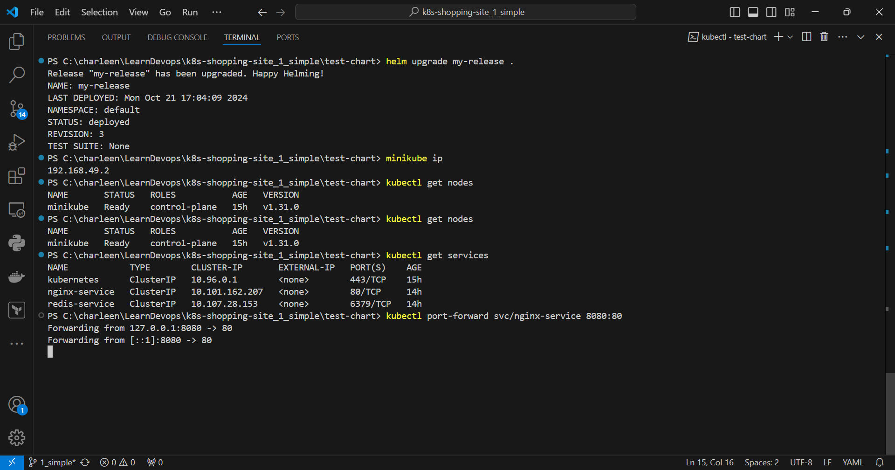
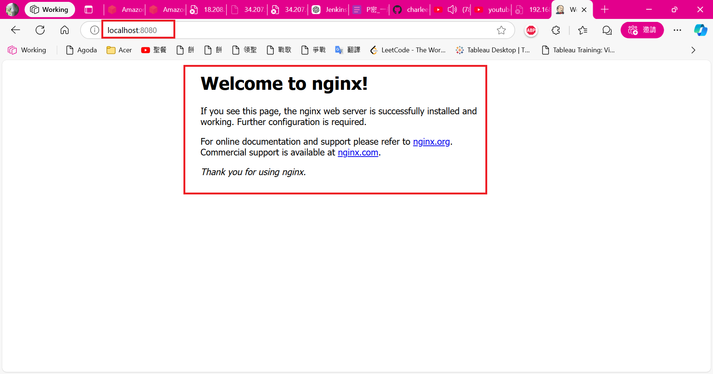
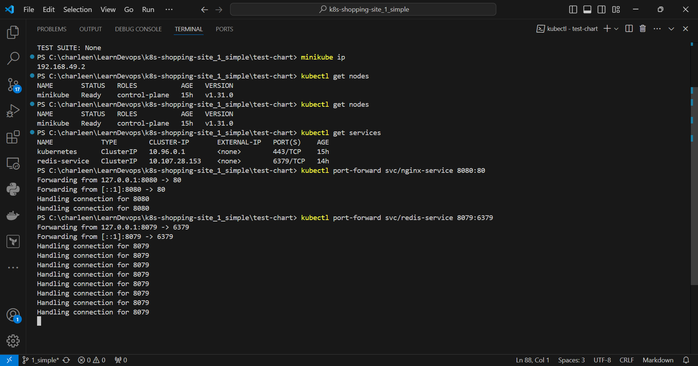
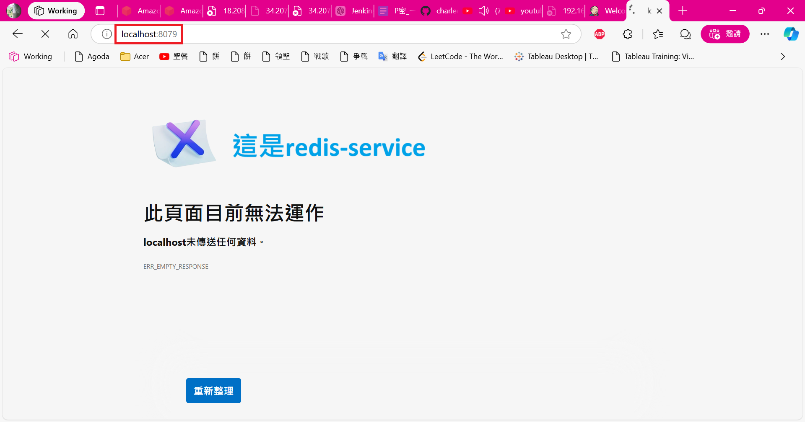

當你對 Kubernetes 相關的 YAML 文件或 Helm chart 進行了修改後，通常需要重新部署或更新應用程式來讓更改生效。以下是幾種常見的操作指令來應用修改：

### 1. **使用 Helm 更新應用**
   如果你是使用 Helm 部署的應用，修改了 Helm chart 或 `values.yaml` 後，應使用以下指令來更新部署：

   ```bash
   helm upgrade my-release .
   ```

   這會根據你的修改重新更新 `my-release` 部署。

### 2. **重新應用 Kubernetes Deployment**
   如果你是直接修改了 Kubernetes 的 YAML 文件（例如 `deployment.yaml` 或 `service.yaml`），可以使用以下指令來重新應用這些配置：

   ```bash
   kubectl apply -f <your-deployment-file>.yaml
   ```

   例如：
   ```bash
   kubectl apply -f deployment.yaml
   kubectl apply -f service.yaml
   ```

### 3. **檢查應用狀態**
   在更新後，可以檢查 Pod 和 Service 的狀態來確保應用程式正常運行：

   ```bash
   kubectl get pods
   kubectl get services
   ```

### 4. **重新啟動 Pod（如果需要）**
   如果某些設定需要強制重啟 Pod 才能生效，你可以刪除當前的 Pod，讓 Kubernetes 自動重啟它們：

   ```bash
   kubectl delete pod <pod-name>
   ```

   Kubernetes 會根據 Deployment 自動創建新的 Pod。

### 檢查並確認更新生效：
   完成更新後，重新檢查你的應用是否成功運行，並嘗試再次訪問應用程式的 URL。

是的，`helm upgrade my-release .` 會自動讓有修改的 `deployment.yaml`、`service.yaml` 等模板文件生效。

具體過程如下：
1. **更新 Chart**：當你修改了 Helm chart 中的模板文件（如 `deployment.yaml` 或 `service.yaml`）或 `values.yaml`，執行 `helm upgrade` 會將這些修改應用到現有的 Kubernetes 資源上。
2. **動態渲染模板**：Helm 會根據 `values.yaml` 和其他參數動態渲染模板（例如 `deployment.yaml` 和 `service.yaml`），生成新的 Kubernetes 資源配置。
3. **自動更新**：Helm 會將新生成的配置與當前運行的 Kubernetes 資源進行比對，並只更新那些有變更的資源，確保只影響需要改變的部分。
   
因此，當你執行 `helm upgrade` 時，所有與 `deployment.yaml`、`service.yaml` 有關的更改都會自動應用，不需要額外執行 `kubectl apply`。

### 小提醒：
- 確認 Helm chart 目錄中的所有文件都保存了最新更改。
- 在升級之前，可以先使用 `helm diff upgrade my-release .` 指令來檢查具體哪些資源會被更新（如果安裝了 `helm-diff` 插件）。

//==================================================================
範例：執行指令及回應訊息：
PS C:\charleen\LearnDevops\k8s-shopping-site_1_simple\test-chart> helm upgrade my-release .
Release "my-release" has been upgraded. Happy Helming!
NAME: my-release
LAST DEPLOYED: Mon Oct 21 17:04:09 2024
NAMESPACE: default
STATUS: deployed
REVISION: 3
TEST SUITE: None
PS C:\charleen\LearnDevops\k8s-shopping-site_1_simple\test-chart> minikube ip
192.168.49.2
PS C:\charleen\LearnDevops\k8s-shopping-site_1_simple\test-chart> kubectl get nodes
NAME       STATUS   ROLES           AGE   VERSION
minikube   Ready    control-plane   15h   v1.31.0
PS C:\charleen\LearnDevops\k8s-shopping-site_1_simple\test-chart> kubectl get nodes
NAME       STATUS   ROLES           AGE   VERSION
minikube   Ready    control-plane   15h   v1.31.0
PS C:\charleen\LearnDevops\k8s-shopping-site_1_simple\test-chart> kubectl get services
NAME            TYPE        CLUSTER-IP       EXTERNAL-IP   PORT(S)    AGE
kubernetes      ClusterIP   10.96.0.1        <none>        443/TCP    15h
nginx-service   ClusterIP   10.101.162.207   <none>        80/TCP     14h
redis-service   ClusterIP   10.107.28.153    <none>        6379/TCP   14h


##### 露出第一個service
PS C:\charleen\LearnDevops\k8s-shopping-site_1_simple\test-chart> kubectl port-forward svc/nginx-service 8080:80
Forwarding from 127.0.0.1:8080 -> 80
Forwarding from [::1]:8080 -> 80





##### 露出第二個service
PS C:\charleen\LearnDevops\k8s-shopping-site_1_simple\test-chart> kubectl port-forward svc/redis-service 8079:6379
Forwarding from 127.0.0.1:8079 -> 6379
Forwarding from [::1]:8079 -> 6379
Handling connection for 8079
Handling connection for 8079




