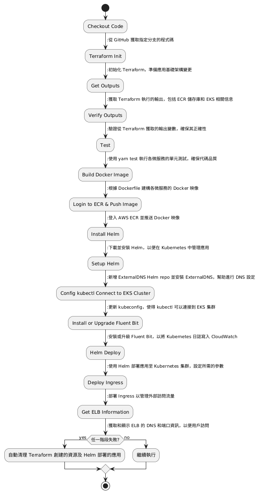

以下是用台灣用語改寫的功能說明書：

## 功能說明書 - k8s-shopping-site 專案

### 簡介
本專案是基於 Kubernetes 的電子商務網站，旨在展示微服務架構下的 CI/CD 流程。透過 Jenkins 自動化工具，使用 Terraform 進行基礎架構的配置，並利用 Docker 和 Helm 來部署各微服務。

### 架構
本專案包含多個微服務，每個微服務透過 Docker 映像進行容器化，並使用 Helm 管理 Kubernetes 上的應用部署。專案主要包含以下組件：

- **Jenkins Pipeline**: 負責整體自動化流程，包括代碼檢出、建置、測試和部署。
- **Terraform**: 負責在 AWS 上建立所需的基礎架構，如 EKS 集群、ECR 儲存庫、CloudWatch 日誌組等。
- **Docker**: 負責容器映像的建置與管理。
- **Helm**: 負責將應用部署到 Kubernetes 集群。

本專案的檔案結構圖如下：

```plaintext
k8s-shopping-site_1_simple (說明：1. 專案說明書.md)
├── Init
│   └── CreateServers.tf          # Terraform 腳本，用於建立 Jenkins Server 和 SonarQube Server (說明：2. Terraform file for Initial 功能說明書.md)
│
├── docker-compose.yml            # 本地開發的 Docker Compose 配置 (說明：3. docker-compose.yml 配置檔的功能說明書.md)
│
├── terraform                     # Terraform 配置，管理 Kubernetes 部署相關基礎設施 (4. Terraform files for EKS deployment 功能說明書.md)
│   ├── main.tf                   # Terraform 主配置檔
│   ├── outputs.tf                # Terraform 輸出變數定義
│   ├── variables.tf              # Terraform 變數定義
│   ├── delete_ecr_images.sh      # 刪除 ECR 本專案公開儲存庫的映像檔 (7. delete_ecr_images.sh 功能說明書.md)
│   └── ManulCleanup.sh           # 清理 Kubernetes 和 Terraform 專案中已部署的資源 (8. ManulCleanup.sh 功能說明書.md)
│
├── k8s-chart                     # Kubernetes Helm chart，用於部署 Kubernetes 資源 (說明：5. Helm Chart 和 Kubernetes 模板檔案 功能說明書.md)
│   ├── charts                    # Helm charts 的子目錄
│   ├── templates                 # Kubernetes 部署和服務模板
│   │   ├── deployment.yaml       # 部署配置模板
│   │   ├── service.yaml          # 服務配置模板
│   ├── .helmignore               # 指定哪些文件在打包 Helm chart 時應被忽略
│   ├── Chart.yaml                # Helm chart 的描述檔
│   └── values.yaml               # Helm values 配置檔，用於覆蓋默認值
│
├── Jenkinsfile                   # Jenkins Pipeline 配置 (說明：6. Jenkins file 功能說明書.md)
├── .env                          # 環境變數設定檔 (說明：9. .env 內容說明書.md)
├── Dockerfile                    # 主網站的 Docker 設定檔 (說明：10. 根目錄 Dockerfile 功能說明書.md)
├── index.js (port: 3000)         # 主網站入口，提供服務連結清單 (說明：11. 根目錄 index.js 功能說明書.md)
├── package-lock.json             # 確保依賴版本一致
├── package.json                  # 依賴包設定
├── yarn.lock                     # Yarn 鎖檔，確保依賴版本一致
│
├── src                           # 專案的主要程式碼資料夾
│   ├── user-service              # User Service 微服務 (說明：12. 微服務 user-service 功能說明書.md)
│   │   ├── Dockerfile            # Docker 映像檔設定檔
│   │   ├── index.js (port: 3001) # 服務的主要程式碼
│   │   ├── package-lock.json     # 確保依賴版本一致
│   │   ├── package.json          # 依賴包設定
│   │   └── yarn.lock             # Yarn 鎖檔，確保依賴版本一致
│   │
│   ├── product-service           # Product Service 微服務 (說明：13. 微服務 product-service 功能說明書.md)
│   │   ├── Dockerfile            # Docker 映像檔設定檔
│   │   ├── index.js (port: 3002) # 服務的主要程式碼
│   │   ├── package-lock.json     # 確保依賴版本一致
│   │   ├── package.json          # 依賴包設定
│   │   └── yarn.lock             # Yarn 鎖檔，確保依賴版本一致
│   │
│   ├── order-service             # Order Service 微服務 (說明：14. 微服務 order-service 功能說明書.md)
│   │   ├── Dockerfile            # Docker 映像檔設定檔
│   │   ├── index.js (port: 3003) # 服務的主要程式碼
│   │   ├── package-lock.json     # 確保依賴版本一致
│   │   ├── package.json          # 依賴包設定
│   │   └── yarn.lock             # Yarn 鎖檔，確保依賴版本一致
│   │
└── └── payment-service           # Payment Service 微服務 (說明：15. 微服務 payment-service 功能說明書.md)
        ├── Dockerfile            # Docker 映像檔設定檔
        ├── index.js (port: 3004) # 服務的主要程式碼
        ├── package-lock.json     # 確保依賴版本一致
        ├── package.json          # 依賴包設定
        └── yarn.lock             # Yarn 鎖檔，確保依賴版本一致
```

### CI/CD Pipeline 階段說明



1. **Checkout Code**
   - 從 GitHub 獲取指定分支的程式碼。

2. **Terraform Init**
   - 初始化 Terraform，準備應用基礎架構變更。

3. **Get Outputs**
   - 獲取 Terraform 執行的輸出，包括 ECR 儲存庫和 EKS 相關資訊。

4. **Verify Outputs**
   - 驗證從 Terraform 獲取的輸出變數，確保其正確性。

5. **Test**
   - 使用 `yarn test` 執行各微服務的單元測試，確保代碼品質。

6. **Build Docker Image**
   - 根據 Dockerfile 建構各微服務的 Docker 映像。

7. **Login to ECR & Push Image**
   - 登入 AWS ECR 並推送 Docker 映像。

8. **Install Helm**
   - 下載並安裝 Helm，以便在 Kubernetes 中管理應用。

9. **Setup Helm**
   - 新增 ExternalDNS Helm repo 並安裝 ExternalDNS，幫助進行 DNS 設定。

10. **Config kubectl Connect to EKS Cluster**
    - 更新 kubeconfig，使得 kubectl 可以連接到 EKS 集群。

11. **Install or Upgrade Fluent Bit**
    - 安裝或升級 Fluent Bit，以將 Kubernetes 日誌寫入 CloudWatch。

12. **Helm Deploy**
    - 使用 Helm 部署應用至 Kubernetes 集群，設定所需的參數。

13. **Deploy Ingress**
    - 部署 Ingress 以管理外部訪問流量。

14. **Get ELB Information**
    - 獲取並顯示 ELB 的 DNS 和端口資訊，以便用戶訪問。

### 錯誤處理
若任一階段失敗，將自動清理 Terraform 創建的資源及 Helm 部署的應用，以確保環境的整潔。

### 結論
本專案展示了在 Kubernetes 環境中實現 CI/CD 的最佳實踐，提供了一個可擴展且高效的微服務架構範例，並強調了使用 Terraform、Docker 和 Helm 等技術的重要性。