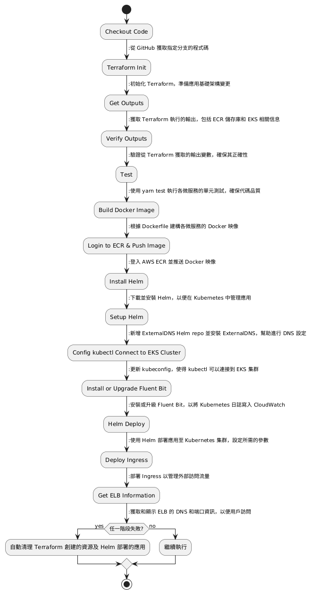

## 專案說明書 - k8s-shopping-site 專案 (3_python_nosql)

### 簡介
本專案是基於 Kubernetes、Python 和 MongoDB 的電子商務網站，旨在展示微服務架構的設計與實現，以及 CI/CD 流程。專案包含多個微服務，涵蓋用戶管理、產品管理、訂單處理和支付服務。透過 Jenkins 自動化工具，使用 Terraform 進行基礎架構的配置，並使用 Docker、Helm 和 Kubernetes 進行容器化與部署。

目前開發中。

### 專案架構
本專案包含多個微服務，每個微服務透過 Docker 映像進行容器化，並使用 Helm 管理 Kubernetes 上的應用部署。專案主要組件如下：

```plaintext
k8s-shopping-site (3_python_nosql)  (說明：1. 專案說明書.md)
├── Init
│   └── CreateServers.tf          # Terraform 腳本，用於建立 Jenkins Server 和 SonarQube Server (說明：2. Terraform file for Initial 功能說明書.md)
│
├── docker-compose.yml            # 本地開發的 Docker Compose 配置 (說明：3. docker-compose.yml 配置檔的功能說明書.md)
│
├── terraform                     # Terraform 配置，管理 Kubernetes 部署相關基礎設施 (說明：4. Terraform files for EKS deployment 功能說明書.md)
│   ├── main.tf                   # Terraform 主配置檔
│   ├── outputs.tf                # Terraform 輸出變數定義
│   ├── variables.tf              # Terraform 變數定義
│   ├── delete_ecr_images.sh      # 刪除 ECR 本專案公開儲存庫的映像檔 (7. delete_ecr_images.sh 功能說明書.md)
│   └── ManulCleanup.sh           # 清理 Kubernetes 和 Terraform 專案中已部署的資源 (說明：8. ManulCleanup.sh 功能說明書.md)
│
├── k8s-chart                     # Kubernetes Helm chart，用於部署 Kubernetes 資源 (說明：5. Helm Chart 和 Kubernetes 模板檔案 功能說明書.md)
│   ├── charts                    # Helm charts 的子目錄
│   ├── templates                 # Kubernetes 部署和服務模板
│   │   ├── deployment.yaml       # 部署配置模板
│   │   ├── service.yaml          # 服務配置模板
│   ├── .helmignore               # 指定哪些文件在打包 Helm chart 時應被忽略
│   ├── Chart.yaml                # Helm chart 的描述檔
│   └── values.yaml               # Helm values 配置檔，用於覆蓋默認值
│
├── Jenkinsfile                   # Jenkins Pipeline 配置 (說明：6. Jenkins file 功能說明書.md)
├── .env                          # 環境變數設定檔 (說明：9. .env 內容說明書.md)
├── Dockerfile                    # 主網站的 Docker 設定檔 (說明：10. 根目錄 Dockerfile 功能說明書.md)
├── LoginPage.py                  # 登入頁面的程式碼 (說明：11. 登入頁 LoginPage.py 功能說明書.md)
├── index.py (port: 3000)         # 主網站入口，提供服務連結清單 (說明：12. 根目錄 index.js 功能說明書.md)
│
├── src                           # 專案的主要程式碼資料夾
│   ├── __init__.py               # 初始化檔案
│   ├── user-service              # 使用者服務微服務  (說明：13. 微服務 user-service 功能說明書.md)
│   │   ├── app.py (port: 3001)   # 使用者服務的主要程式碼
│   │   ├── Dockerfile            # Docker 映像檔設定檔
│   │   ├── UserCRUDPage.py       # 使用者服務的 CRUD 操作頁面
│   │
│   ├── product-service           # 產品服務微服務 (說明：14. 微服務 product-service 功能說明書.md)
│   │   ├── app.py (port: 3002)   # 產品服務的主要程式碼
│   │   ├── Dockerfile            # Docker 映像檔設定檔
│   │   ├── ProductCRUDPage.py    # 產品服務的 CRUD 操作頁面
│   │
│   ├── order-service             # 訂單服務微服務 (說明：15. 微服務 order-service 功能說明書.md)
│   │   ├── app.py (port: 3003)   # 訂單服務的主要程式碼
│   │   ├── Dockerfile            # Docker 映像檔設定檔
│   │   ├── OrderCRUDPage.py      # 訂單服務的 CRUD 操作頁面
│   │
│   └── payment-service           # 付款服務微服務 (說明：16. 微服務 payment-service 功能說明書.md)
│       ├── app.py (port: 3004)   # 付款服務的主要程式碼
│       ├── Dockerfile            # Docker 映像檔設定檔
│       └── PaymentCRUDPage.py    # 付款服務的 CRUD 操作頁面
│
├── tests                         # 測試資料夾
│   ├── test_order-service.py     # 訂單服務的測試檔案
│   ├── test_payment-service.py   # 付款服務的測試檔案
│   ├── test_product-service.py   # 產品服務的測試檔案
│   └── test_user-service.py      # 使用者服務的測試檔案
│
├── requirements.txt              # Python 依賴檔案
├── init_db.py                    # 初始化資料庫的腳本   (說明：17. 資料庫初始化 init_db.py 功能說明書.md)
├── db_connection_pool.py         # 資料庫連接池   (說明：18. 資料庫連線池 db_connection_pool.py 功能說明書.md)
├── readevn.py                    # 讀取環境變數的腳本
├── db_test.py                    # 資料庫測試
```

### 技術棧

- **語言**: Python
- **數據庫**: MongoDB
- **微服務架構**: 各服務獨立運行，包括用戶管理、產品、訂單處理和支付
- **容器化**: Docker
- **編排**: Kubernetes
- **CI/CD**: Jenkins

### 功能介紹

- **用戶服務**: 管理用戶的註冊、登入及資訊更新。
- **產品服務**: 提供產品的新增、刪除、修改及查詢功能。
- **訂單服務**: 處理用戶訂單的管理及查詢。
- **支付服務**: 整合支付處理功能。

### 安裝與運行

1. 確保已安裝 [Docker](https://www.docker.com/) 和 [Docker Compose](https://docs.docker.com/compose/)。

2. 複製專案到本地機器：
   ```bash
   git clone <repository-url>
   cd k8s-shopping-site_3_python_nosql
   ```
3. 安裝 Python 依賴：
   ```bash
   pip install -r requirements.txt
   ```
4. 設定環境變數：
   將 `.env` 文件根據需求配置好。
   
5. 啟動服務：
   使用 Docker Compose 啟動所有服務：
   ```bash
   docker-compose up --build
   ```

### CI/CD Pipeline 階段說明




1. **Checkout Code**
   - 從 GitHub 獲取指定分支的程式碼。
  
2. **Terraform Init**
   - 初始化 Terraform，準備應用基礎架構變更。
  
3. **Get Outputs**
   - 獲取 Terraform 執行的輸出，包括 ECR 儲存庫和 EKS 相關資訊。
  
4. **Verify Outputs**
   - 驗證從 Terraform 獲取的輸出變數，確保其正確性。
  
5. **Test**
   - 使用 `pytest` 執行各微服務的單元測試，確保代碼品質。
  
6. **Build Docker Image**
   - 根據 Dockerfile 建構各微服務的 Docker 映像。
  
7. **Login to ECR & Push Image**
   - 登入 AWS ECR 並推送 Docker 映像。
  
8. **Install Helm**
   - 下載並安裝 Helm，以便在 Kubernetes 中管理應用。
  
9. **Setup Helm**
   - 新增 ExternalDNS Helm repo 並安裝 ExternalDNS，幫助進行 DNS 設定。
  
10. **Config kubectl Connect to EKS Cluster**
    - 更新 kubeconfig，使得 kubectl 可以連接到 EKS 集群。
  
11. **Install or Upgrade Fluent Bit**
    - 安裝或升級 Fluent Bit，以將 Kubernetes 日誌寫入 CloudWatch。
  
12. **Helm Deploy**
    - 使用 Helm 部署應用至 Kubernetes 集群，設定所需的參數。
  
13. **Deploy Ingress**
    - 部署 Ingress 以管理外部訪問流量。
  
14. **Get ELB Information**
    - 獲取並顯示 ELB 的 DNS 和端口資訊，以便用戶訪問。

### 錯誤處理
若任一階段失敗，將自動清理 Terraform 創建的資源及 Helm 部署的應用，以確保環境的整潔。

## 測試

運行以下命令執行所有單元測試：
```bash
pytest tests/
```

### 結論
本專案展示了在 Kubernetes 環境中實現 CI/CD 的最佳實踐，提供了一個可擴展且高效的微服務架構範例，並強調了使用 Terraform、Docker 和 Helm 等技術的重要性。