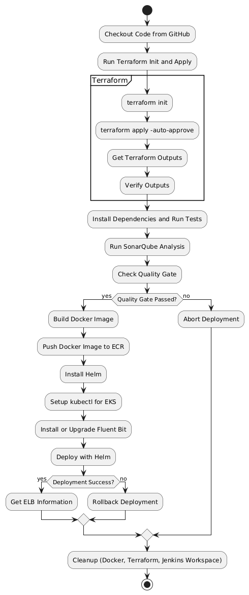

## 專案說明書 - k8s-shopping-site 專案 (2_nodejs_mysql)

### 簡介
本專案是基於 Kubernetes、Node.js 和 MySQL 的電子商務網站，旨在展示微服務架構的設計與實現，以及 CI/CD 流程。專案包含多個微服務，涵蓋使用者管理、產品管理、訂單處理和付款服務。透過 Jenkins 自動化工具，使用 Terraform 進行基礎架構的配置，並使用 Docker、Helm 和 Kubernetes 進行容器化與部署。

目前開發中。

### 專案架構
本專案包含多個微服務，每個微服務透過 Docker 映像進行容器化，並使用 Helm 管理 Kubernetes 上的應用部署。專案主要組件如下：

```plaintext
k8s-shopping-site (2_nodejs_mysql)  (說明：1. 專案說明書.md)
├── Init
│   └── CreateServers.tf          # Terraform 腳本，用於建立 Jenkins Server 和 SonarQube Server (說明：2. Terraform file for Initial 功能說明書.md)
│
├── docker-compose.yml            # 本地開發的 Docker Compose 配置 (說明：3. docker-compose.yml 配置檔的功能說明書.md)
│
├── terraform                     # Terraform 配置，管理 Kubernetes 部署相關基礎設施 (說明：4. Terraform files for EKS deployment 功能說明書.md)
│   ├── main.tf                   # Terraform 主配置檔
│   ├── outputs.tf                # Terraform 輸出變數定義
│   ├── variables.tf              # Terraform 變數定義
│   ├── delete_ecr_images.sh      # 刪除 ECR 本專案公開儲存庫的映像檔 (說明：7. delete_ecr_images.sh 功能說明書.md)
│   └── ManulCleanup.sh           # 清理 Kubernetes 和 Terraform 專案中已部署的資源 (說明：8. ManulCleanup.sh 功能說明書.md)
│
├── k8s-chart                     # Kubernetes Helm chart，用於部署 Kubernetes 資源 (說明：5. Helm Chart 和 Kubernetes 模板檔案 功能說明書.md)
│   ├── charts                    # Helm charts 的子目錄
│   ├── templates                 # Kubernetes 部署和服務模板
│   │   ├── deployment.yaml       # 部署配置模板
│   │   ├── service.yaml          # 服務配置模板
│   ├── .helmignore               # 指定哪些文件在打包 Helm chart 時應被忽略
│   ├── Chart.yaml                # Helm chart 的描述檔
│   └── values.yaml               # Helm values 配置檔，用於覆蓋默認值
│
├── Jenkinsfile                   # Jenkins Pipeline 配置 (說明：6. Jenkins file 功能說明書.md)
├── .env                          # 環境變數設定檔 (說明：9. .env 內容說明書.md)
├── Dockerfile                    # 主網站的 Docker 設定檔 (說明：10. 根目錄 Dockerfile 功能說明書.md)
│
├── user-service                  # User Service 微服務  (說明：13. 微服務 user-service 功能說明書.md)
│   ├── src                       # 源碼目錄
│   │   ├── user-service.js (port: 3001)   # User Service 的主要程式碼
│   ├── test                      # 測試目錄
│   │   └── user.test.js          # User Service 的測試檔案
│   ├── .dockerignore             # Docker 忽略文件配置
│   ├── Dockerfile                # Docker 映像檔設定檔
│   ├── package.json              # Node.js 專案設定檔
│   └── webpack.config.js         # Webpack 配置文件
│
├── product-service               # Product Service 微服務 (說明：14. 微服務 product-service 功能說明書.md)
│   ├── src                       # 源碼目錄
│   │   ├── product-service.js (port: 3002)   # Product Service 的主要程式碼
│   ├── test                      # 測試目錄
│   │   └── product.test.js       # Product Service 的測試檔案
│   ├── .dockerignore             # Docker 忽略文件配置
│   ├── Dockerfile                # Docker 映像檔設定檔
│   ├── package.json              # Node.js 專案設定檔
│   └── webpack.config.js         # Webpack 配置文件
│
├── order-service                 # Order Service 微服務 (說明：15. 微服務 order-service 功能說明書.md)
│   ├── src                       # 源碼目錄
│   │   └── order-service.js (port: 3003)   # Order Service 的主要程式碼
│   ├── test                      # 測試目錄
│   │   └── order.test.js         # Order Service 的測試檔案
│   ├── .dockerignore             # Docker 忽略文件配置
│   ├── Dockerfile                # Docker 映像檔設定檔
│   ├── package.json              # Node.js 專案設定檔
│   └── webpack.config.js         # Webpack 配置文件
│
├── payment-service               # Payment Service 微服務 (說明：16. 微服務 payment-service 功能說明書.md)
│   ├── src                       # 源碼目錄
│   │   ├── payment-service.js (port: 3004)   # Payment Service 的主要程式碼
│   ├── test                      # 測試目錄
│   │   └── payment.test.js       # Payment Service 的測試檔案
│   ├── .dockerignore             # Docker 忽略文件配置
│   ├── Dockerfile                # Docker 映像檔設定檔
│   ├── package.json              # Node.js 專案設定檔
│   └── webpack.config.js         # Webpack 配置文件
│
├── web-client                    # Web 前端客戶端
│   ├── public                    # 公開資源目錄
│   │   ├── index.html            # 主網頁檔案
│   ├── src                       # 源碼目錄
│   │   ├── components            # 元件目錄
│   │   │   ├── CRUDPage.js       # CRUD 操作元件
│   │   │   ├── OrderCRUDPage     
│   │   │   │   ├── OrderCRUDPage.js   # 訂單服務的 CRUD 操作頁面
│   │   │   ├── PaymentCRUDPage   
│   │   │   │   ├── PaymentCRUDPage.js # 付款服務的 CRUD 操作頁面
│   │   │   ├── ProductCRUDPage   
│   │   │   │   ├── ProductCRUDPage.js # 產品服務的 CRUD 操作頁面
│   │   │   └── UserCRUDPage      
│   │   │       └── UserCRUDPage.js    # 使用者服務的 CRUD 操作頁面
│   │   ├── LoginPage.js          # 登入頁面的程式碼  (說明：11. 登入頁 LoginPage.js 功能說明書.md)
│   │   ├── App.js                # 主應用程式入口文件 (說明：12. React 應用程式的入口及主頁設定 功能說明書 .md)
│   │   ├── index.js              # 主要的 JavaScript 入口文件 (說明：12. React 應用程式的入口及主頁設定 功能說明書 .md)
│   ├── test                      # 測試目錄
│   │   ├── App.test.js           # 主應用程式的測試檔案
│   │   ├── LoginPage.test.js     # 登入頁面的測試檔案
│   │   ├── OrderCRUDPage.test.js # 訂單服務的 CRUD 測試檔案
│   │   ├── PaymentCRUDPage.test.js # 付款服務的 CRUD 測試檔案
│   │   ├── ProductCRUDPage.test.js # 產品服務的 CRUD 測試檔案
│   │   ├── UserCRUDPage.test.js  # 使用者服務的 CRUD 測試檔案
│   ├── .dockerignore             # Docker 忽略文件配置
│   ├── Dockerfile                # Docker 設定檔
│   ├── package.json              # Node.js 專案設定檔
│   └── webpack.config.js         # Webpack 配置文件
│
├── init_db.js                    # 初始化資料庫的腳本   (說明：17. 資料庫初始化 init_db.js 功能說明書.md)
├── db_connection_pool.js         # 資料庫連接池   (說明：18. 資料庫連線池 db_connection_pool.js 功能說明)
├── dbTest.js                     # 資料庫測試腳本
├── package.json                  # Node.js 專案設定檔
├── config.js                     # 應用程式配置文件
├── .babelrc                      # Babel 配置文件
├── .dockerignore                 # Docker 忽略文件配置
├── webpack.config.js             # Webpack 配置文件
├── yarn.lock                     # Yarn 鎖檔案，確保依賴版本一致
└── dist                          # 編譯後的靜態檔案目錄
    └── bundle.js                 # 打包後的 JavaScript 文件
```

### 技術棧

- **語言**: Node.js
- **數據庫**: MySQL
- **微服務架構**: 各服務獨立運行，包括使用者管理、產品、訂單處理和付款
- **容器化**: Docker
- **編排**: Kubernetes
- **CI/CD**: Jenkins

### 功能介紹

- **使用者服務**: 管理使用者的註冊、登入及資訊更新。
- **產品服務**: 提供產品的新增、刪除、修改及查詢功能。
- **訂單服務**: 處理使用者訂單的管理及查詢。
- **付款服務**: 整合付款處理功能。

### 安裝與運行

1. 確保已安裝 [Docker](https://www.docker.com/) 和 [Docker Compose](https://docs.docker.com/compose/)。
   
2. 複製專案到本地機器：
   ```bash
   cd <父目錄>
   git clone -b 2_nodejs_mysql https://github.com/charleenchiu/k8s-shopping-site.git k8s-shopping-site_2_nodejs_mysql
   ```

3. 安裝 Node.js 依賴：
   ```bash
   npm install
   ```

4. 設定環境變數：
   將 `.env` 文件根據需求配置好。

5. 啟動服務：
   使用 Docker Compose 啟動所有服務：
   ```bash
   docker-compose up --build
   ```

### CI/CD Pipeline 階段說明



1. **Checkout Code**
   - 從 GitHub 獲取指定分支的程式碼。

2. **Terraform Init**
   - 初始化 Terraform，準備應用基礎架構變更。

3. **Get Outputs**
   - 獲取 Terraform 執行的輸出，包括 ECR 儲存庫和 EKS 相關資訊。

4. **Verify Outputs**
   - 驗證從 Terraform 獲取的輸出變數，確保其正確性。

5. **Test**
   - 使用 `yarn test` 執行各微服務的單元測試，確保代碼品質。

6. **Build Docker Image**
   - 根據 Dockerfile 建構各微服務的 Docker 映像。

7. **Login to ECR & Push Image**
   - 登入 AWS ECR 並推送 Docker 映像。

8. **Install Helm**
   - 下載並安裝 Helm，以便在 Kubernetes 中管理應用。

9. **Config kubectl Connect to EKS Cluster**
    - 更新 kubeconfig，使得 kubectl 可以連接到 EKS 集群。

10. **Install or Upgrade Fluent Bit**
    - 安裝或升級 Fluent Bit，以將 Kubernetes 日誌寫入 CloudWatch。

11. **Helm Deploy**
    - 使用 Helm 部署應用至 Kubernetes 集群，設定所需的參數。

12. **Get ELB Information**
    - 獲取並顯示 ELB 的 DNS 和端口資訊，以便使用者訪問。

### 錯誤處理
若任一階段失敗，將自動清理 Terraform 創建的資源及 Helm 部署的應用，以確保環境的整潔。

## 測試

運行以下命令執行所有單元測試：
```bash
yarn test
```

### 結論
本專案展示了在 Kubernetes 環境中實現 CI/CD 的最佳實踐，提供了一個可擴展且高效的微服務架構範例，並強調了使用 Terraform、Docker 和 Helm 等技術的重要性。